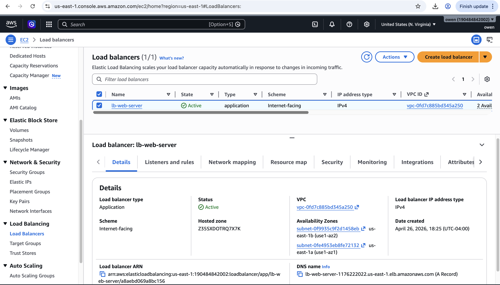

# AWS Auto Scaling Web Server

> 🚀 Built as part of my journey to becoming a Cloud Engineer

---

## Overview

This project demonstrates a highly available, self-healing, load-balanced web server environment built on AWS.

I deployed EC2 instances using an Auto Scaling Group behind an Application Load Balancer. The instances are created from a Launch Template using a User Data script that automatically installs Apache and serves a webpage displaying instance metadata.

---

## Architecture

- Amazon EC2  
- Application Load Balancer (ALB)  
- Target Group  
- Auto Scaling Group  
- Launch Template  
- Security Groups  
- Amazon Linux 2023  
- Apache HTTP Server  

---

## Features

- Automated EC2 provisioning using User Data  
- Load balancing across multiple EC2 instances  
- Multi-Availability Zone deployment (High Availability)  
- Health checks via Target Group  
- Auto Scaling self-healing capability  
- Dynamic webpage displaying:
  - Instance ID  
  - Availability Zone  

---

## How It Works

1. A Launch Template defines how EC2 instances are created  
2. A User Data script installs and starts Apache automatically  
3. The Auto Scaling Group maintains the desired number of instances  
4. The Application Load Balancer distributes traffic across healthy instances  
5. If an instance fails or is terminated, Auto Scaling automatically launches a replacement  

---

## Testing (Self-Healing)

To test fault tolerance, I manually terminated one EC2 instance from the Auto Scaling Group.

Within minutes, a new instance was automatically launched to replace it, demonstrating the self-healing capability of the system.

---

## Screenshots

### Load Balancer (Active)

### Target Group (Healthy Instances)

### Load Balanced Web Server - Instance 1

### Load Balanced Web Server - Instance 2

### Instance Replacement (Auto Scaling)

---

## User Data Script

See `user-data.sh` for the script used to automatically configure EC2 instances.

---

## What I Learned

- How to deploy EC2 instances automatically using Launch Templates  
- How to configure an Application Load Balancer  
- How Target Groups and health checks work  
- How Auto Scaling Groups provide self-healing infrastructure  
- How to use EC2 metadata (IMDSv2)  

---

## Why This Project Matters

This project demonstrates real-world cloud engineering concepts used in production environments, including high availability, fault tolerance, and automated infrastructure.

It shows the ability to design systems that remain operational even when components fail — a key requirement for modern cloud applications.
