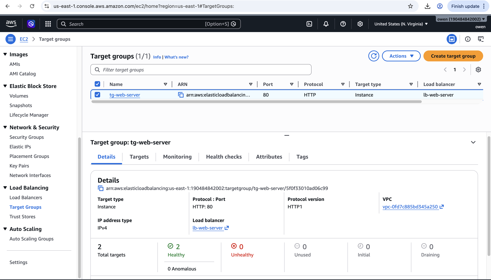
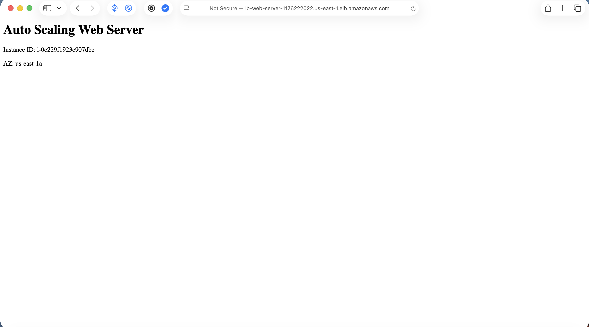

# AWS Auto Scaling Web Server

## Overview
This project demonstrates a highly available, self-healing, load-balanced web server environment built on AWS.

I deployed EC2 instances using an Auto Scaling Group behind an Application Load Balancer. The instances are created from a Launch Template using a User Data script that automatically installs Apache and serves a webpage displaying instance metadata.

---

## Architecture
- Amazon EC2
- Application Load Balancer (ALB)
- Target Group
- Auto Scaling Group
- Launch Template
- Security Groups
- Amazon Linux 2023
- Apache HTTP Server

---

## Features
- Automated EC2 provisioning using User Data
- Load balancing across multiple EC2 instances
- Multi-Availability Zone deployment (High Availability)
- Health checks via Target Group
- Auto Scaling self-healing capability
- Dynamic webpage displaying:
  - Instance ID
  - Availability Zone

---

## How It Works
1. A Launch Template defines how EC2 instances are created.
2. A User Data script installs and starts Apache automatically.
3. The Auto Scaling Group maintains the desired number of instances.
4. The Application Load Balancer distributes incoming traffic across healthy instances.
5. If an instance fails or is terminated, Auto Scaling automatically launches a replacement.

---

## Testing (Self-Healing)
To test fault tolerance:
- I manually terminated an EC2 instance.
- Within minutes, the Auto Scaling Group launched a replacement instance automatically.

---

## Screenshots

### Load Balancer (Active)

### Target Group (Healthy Instances)

### Load Balanced Web Server - Instance 1

### Load Balanced Web Server - Instance 2

---

## User Data Script
See `user-data.sh`

---

## What I Learned
- How to deploy EC2 instances using Launch Templates
- How to configure an Application Load Balancer
- How Target Groups and health checks work
- How Auto Scaling Groups provide self-healing infrastructure
- How to use EC2 Instance Metadata (IMDSv2)
